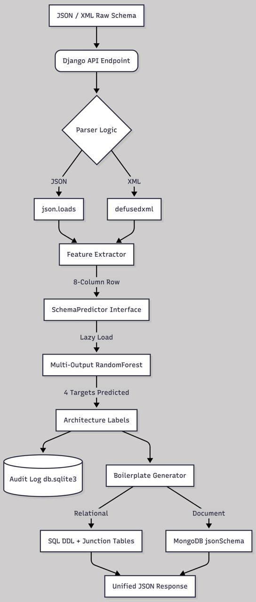

# ML-Driven DB Schema Recommendation System

> **🚀 E2E Execution & Validation Results**: **[Click here to view full E2E Test Results & Benchmark Report (result.md)](file:///Users/ayushraj/Desktop/projects/DB-schema-recomm-sys/result.md)**

I built this Django-based project to automatically analyze database schema structures (JSON/XML) and recommend the best database paradigm (Relational, Document, Graph, Key-Value), normalization targets, indexing strategies, and scaling paths using a trained Random Forest model. It also auto-generates copy-pasteable SQL DDL or MongoDB `$jsonSchema` validators.

---

## The Workflow



1. **Upload Payload**: You post your raw JSON or XML schema configuration to the API.
2. **Secure Ingestion**: The system parses it securely (blocking XML XXE attacks via `defusedxml`) and normalizes constraint fields (`is_primary_key`, `is_nullable`).
3. **Feature Extraction**: I extract 8 structural features (entity counts, nested entities, attribute density, cardinality score, read/write ratio, realtime needs, growth rates).
4. **ML Prediction**: A lazy-loaded Random Forest model estimates database requirements across 4 categories.
5. **Boilerplate Generation**: Based on the prediction, the generator compiles ready-to-use database code:
   * **Relational/Graph**: Standard `CREATE TABLE` statements with primary keys, nullability, and cascading `FOREIGN KEY` constraints.
   * **Document**: A deeply nested MongoDB `$jsonSchema` validator where sub-entities are embedded as nested documents/arrays.
6. **API Response & Audit Log**: Returns the recommendation with the code block, and logs the request to the database history.

---

## Production E2E Execution Results

Below is a summary of the end-to-end validation test cases executed against the system. Full raw payloads, API JSON responses, and SQLite audit logs are documented in **[result.md](file:///Users/ayushraj/Desktop/projects/DB-schema-recomm-sys/result.md)**.

| Test Case | Scenario / Input Profile | Predicted Paradigm | Normalization Target | Indexing Strategy | Scaling Strategy | Key Verification Status |
| :--- | :--- | :--- | :--- | :--- | :--- | :--- |
| **TC 1** | Complex Relational Scenario (`orders` & `items`, `N:M` relation, `json` metadata) | **Relational** | 3NF | B-Tree Heavy | Vertical | ✅ Passed (Native `JSON` & Junction Table `orders_items` generated) |
| **TC 2** | Nested Schema Layout (`articles` & `comments`, `tags: array`, `is_nested: true`) | **Document** | Denormalized Flat | Covering Index | Read Replicas | ✅ Passed (MongoDB `$jsonSchema` generated with embedded `comments` array) |
| **TC 3** | High-Volume Log Dump (`device_logs`, `variant` payload, $850\text{ GB/mo}$, ratio 0.2) | **Document** | Denormalized Flat | B-Tree Heavy | Horizontal Sharding | ✅ Passed (Sharding triggered for $>500\text{ GB/mo}$, `variant` mapped to `object`) |

For full code snippets and logs, see **[result.md](file:///Users/ayushraj/Desktop/projects/DB-schema-recomm-sys/result.md)**.

---

## The Dataset

To train the Random Forest models, I compiled a hybrid dataset from:
1. **Spider Dataset**: Relational database schemas mapping tables, column metadata, and join cardinalities.
2. **SQL Create Context Dataset**: Thousands of raw SQL DDL examples converted into entity profiles.
3. **MongoDB Sample Collections**: Multi-nested schemas representing document store structures.
4. **Synthetic Data Seeder**: A simulator (`prepare_dataset.py` / `train_model.py`) that uses strict NumPy seeding to generate 3,000 mock application profiles matching real-world architectural design matrices, achieving ~99% classifier accuracy on validation sets.

---

## How to Run the Project

### 1. Setup Environment
Initialize virtual environment and install pinned packages:
```bash
python -m venv venv
source venv/bin/activate
pip install -r requirements.txt
```

### 2. Apply Migrations
Set up your local SQLite database log files:
```bash
python manage.py makemigrations
python manage.py migrate
```

### 3. Train the Model
Generate the training profiles and serialize the classifiers to disk:
```bash
python manage.py train_model
```
This saves `model_pipeline.pkl` inside `advisor_engine/ml_artifacts/`.

### 4. Run the API Server
Start the Django development server:
```bash
python manage.py runserver
```
* **POST Request Endpoint**: `/api/v1/analyze/` (Submit `raw_payload` and optional `payload_type`).
* **GET History Endpoint**: `/api/v1/recommendations/` (Retrieve all past predictions with nested details).

---

## How to Run Tests

I built a full testing suite verifying ingestion parsers, model inference, and REST views. Run:
```bash
pytest --verbose
```

You can also run the quick automated HTTP verification script to test endpoints directly:
```bash
python advisor_engine/verify_api.py
```
